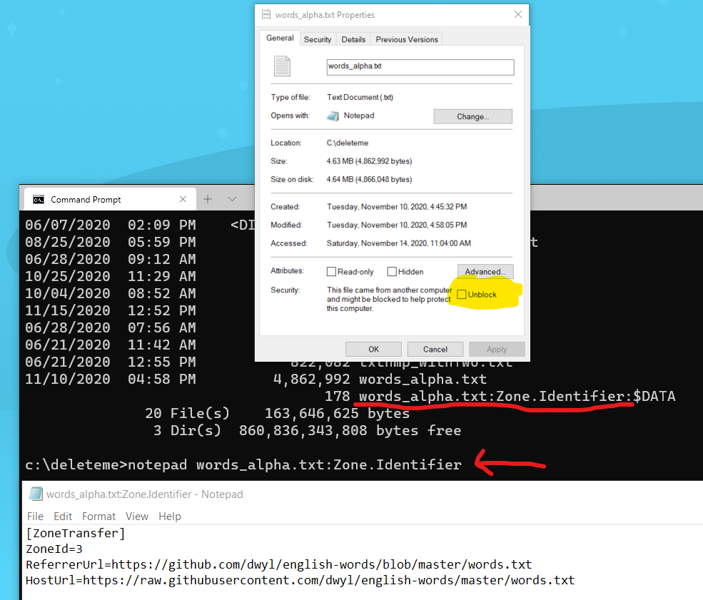

# Size on Disk

The clue:

> There's a file on the linked hard disk, I can't figure out why the size on disk is so big for such a simple txt file. (Windows Only)  

 Additionally, you are given a download link for a virtual hard disk. The reason I had to provide a vhd is because the challenge is to realize the file on the disk has data written to an Alternate Data Stream. If you want more detail please read my old blog post:  

[Fun with NTFS Alternate Data Streams](https://contrivedexample.com/2017/04/16/fun-with-ntfs-alternate-data-streams/)  

If I had just uploaded the file to the website only the default stream would have been written. To keep the alternate stream(s) intact, I had to embed it in a vhd.  

To capture the flag, you need only open the alternate stream. The data is just text (though it doesn't need to be) so you can drop to a command prompt and run: `notepad.exe funwithfiles.txt:Flag` . This tells Notepad to open the alternate stream named "Flag" instead of the default stream which only contains "Nothing to see here".  

Alternate data streams are not as common an attack vector as they used to be, but they can still play a part in orchestrated attacks. They are definitely still in use. Have you ever wondered what the "unblock" checkbox on the properties of a file you have downloaded is all about? This means that when you downloaded the file, Windows wrote an alternate data stream to it so that it can know it came from the Internet, and thus to treat it suspiciously. Observe the properties and content of a file that I have downloaded to my system. I used a `dir /R` to obtain the alternate data stream details in the console:  

